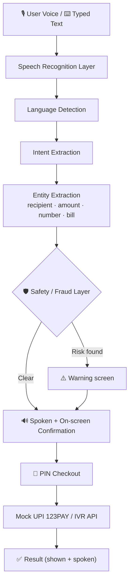
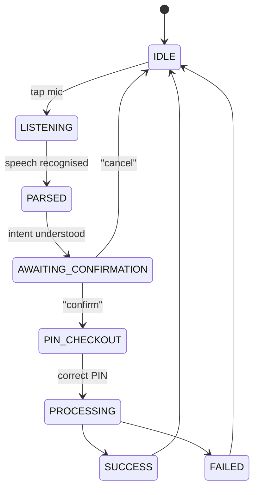

<div align="center">

# 🎙️ VaaniPay

### *Banking in your language. Payments with confidence.*

A **voice-first digital payments app** that speaks the language of the people it serves, built for low-literacy, elderly and regional-language users.

## 💡 The Problem

Digital payments have transformed India, but the apps assume you can **read English, navigate dense menus and type accurately**. For millions of people, that's a wall.

| Who is left behind | What goes wrong |
|---|---|
| 🧓 **Elderly users** | Small text, complex menus, fear of pressing the wrong button |
| 📖 **Low-literacy users** | Text-heavy screens they can't confidently read |
| 🗣️ **Regional-language speakers** | English-first interfaces, unfamiliar banking words |
| 📱 **Feature-phone / low-bandwidth users** | Apps that don't work for them at all |
| 🎣 **Everyone, especially new users** | Easy targets for OTP and PIN scams |

## ✅ Our Solution

> **"You don't need to know how to navigate a banking app. Just tell VaaniPay what you want to do."**

VaaniPay keeps the **familiar layout of popular Indian payment apps** (so there's nothing new to learn) and puts a **voice assistant at the centre**, with typed input always available as a fallback.

<table>
<tr>
<td width="50%" valign="top">

### 🗣️ Speak naturally
Say *"Send 500 rs to Aditi"* or *"मला अदितीला पाचशे रुपये पाठवायचे आहेत"*. VaaniPay understands the language, the person and the amount.

### 🔊 Hear it back
Every request is read aloud, with **numbers spoken as native-language words** in a pleasant voice, so users can verify without reading.

</td>
<td width="50%" valign="top">

### 🔐 Confirm, then PIN
Voice **never** pays directly. Every payment goes through spoken confirmation and a PIN checkout first.

### 🛡️ Stay protected
New-recipient warnings, high-amount alerts and scam-phrase detection keep users safe from fraud.

</td>
</tr>
</table>

---

## ✨ Features

### 🎙️ Voice Assistant (the hero)

```text
 You say  →  "send 500 rs to Aditi"
 App reads →  "You said: send five hundred rupees to Aditi"
 App asks  →  "Do you want to send five hundred rupees to Aditi? Say confirm or cancel."
 You say  →  "confirm payment"
 App opens →  🔐 PIN checkout   →   ✅ Payment successful (simulated)
```

- Live transcript while speaking, shown in a chat-style bubble
- Parsed card showing **Intent · Recipient · Amount · Language**
- "How VaaniPay understood you" panel with the raw JSON, for transparency
- Low confidence? It **asks a clarifying question** instead of guessing

### 🔐 PIN & Privacy

| Feature | Behaviour |
|---|---|
| **App lock** | PIN screen on every launch (demo PIN `1234`) |
| **Hidden balance** | Balance shown as `••••••` and revealed **only after PIN**, then auto-hides in 10 seconds |
| **Voice PIN** | Say *"1234"*, *"one two three four"* or *"एक दोन तीन चार"*. Digits fill masked dots instantly |
| **Never exposed** | Spoken PIN is never displayed, logged, stored or read aloud |
| **Lockout** | 3 wrong attempts lock the app for 30 seconds |

### 💸 Payments

- 📷 **Scan & Pay**: simulated QR scanner
- 📥 **Receive Money**: My QR, UPI ID, copy / share, *"Speak my UPI ID"*
- 📞 **Pay to Mobile Number**: by **voice or keypad**. Handles *"double nine"*, chunked speech and native-language digits
- 🆔 **Pay to UPI ID** with verification
- 👥 **Pay to Contact** with search by typing or voice
- 🙋 **Request Money**

**Every payment follows the same safe path:**

`Amount → Review + safety checks → PIN → Processing → Success receipt`

### 🧾 Bills, Loans, SIP & Rewards

| Recharge & Bills | Money & Investments | Rewards |
|---|---|---|
| Mobile Recharge · DTH | Loans + EMI calculator | Scratch cards |
| Electricity · Water · Gas | SIP / Mutual Funds | Cashback |
| Broadband · FASTag | Fixed Deposit · Gold | Referral code |
| Credit Card · Rent | Insurance | Coupons |
| School Fees · Loan EMI | Credit Score | |

### 🔔 Smart Bill Alerts

- Colour-coded banner on Home: 🟠 upcoming · 🔴 overdue
- Notification centre grouped as **Due Today / Upcoming / Overdue / Offers / Security**
- After login, a popup **reads your due bills aloud**: *"You have 2 bills due. Electricity bill of ₹1,240 is due in 2 days."*
- Paying from an alert still goes through confirmation and PIN

### 🛡️ Fraud & Safety Layer

- ⚠️ Flags: new recipient · amount over ₹5,000 · unusually large amount · unknown number · first-time UPI ID
- 🚫 Scam-word detection (OTP, UPI PIN, password, CVV) with a clear warning: **"Never share your UPI PIN or OTP with anyone."**
- 🏛️ **Safety Center** with tips, a mock *Report suspicious activity* form and *Block a contact*

### 🌐 Full Language Support

<div align="center">

**English** · **मराठी** · **हिंदी** · **தமிழ்** · **తెలుగు** · **বাংলা**

</div>

Every string in the UI switches with the language: navigation, buttons, alerts, errors and notifications. Speech recognition and synthesis use the matching locale (`en-IN`, `mr-IN`, `hi-IN`, `ta-IN`, `te-IN`, `bn-IN`).

### ♿ Accessibility First

| Mode | What it does |
|---|---|
| 🔊 **Listen button** | Reads the current screen aloud in the chosen language |
| 🔠 **Large text** | Three text sizes |
| 🌗 **High contrast** | WCAG AA contrast and clear focus states |
| 👆 **Simplified mode** | Home becomes **6 giant buttons**: Send · Balance · Scan · Receive · Bills · Help |
| 🗣️ **Voice-only mode** | Fully conversational banking, from request to confirmation to result |
| 🎚️ **Voice controls** | Voice picker, speed slider, test button |

---

## 🏗️ Architecture



### Assistant State Machine



### 🧰 Tech Stack

| Layer | Technology |
|---|---|
| Frontend | React · TypeScript · Tailwind CSS |
| Speech input | Web Speech API (`SpeechRecognition`) |
| Speech output | `speechSynthesis` behind a pluggable `TTSProvider` (cloud TTS like Bhashini / Google / Azure can be swapped in) |
| Intent & entities | Frontend rule-based engine simulating an NLU layer |
| Data | Mock JSON, in-memory state |
| Payments | Simulated UPI 123PAY / IVR API |
| Fonts | Noto Sans + Devanagari · Tamil · Telugu · Bengali |

---

## 🚀 Quick Start

**Prerequisites:** Node.js 18+ and **Google Chrome** or **Microsoft Edge** (best speech recognition and voices).

```bash
# 1. Clone
git clone https://github.com/aditinitnaware/VaaniPay.git
cd VaaniPay

# 2. Install
npm install

# 3. Run
npm run dev
```

Open the URL shown in your terminal (usually `http://localhost:5173`).

```bash
# Production build
npm run build
npm run preview
```

> [!NOTE]
> Speech recognition needs **HTTPS or localhost** and microphone permission.

### 🔑 Demo Credentials

| Item | Value |
|---|---|
| App PIN | `1234` *(demo only)* |
| Sample UPI ID | `yourname@vaani` |
| Mock contacts | Aditi · Raju · Mom · Amit · Priya · Electricity Board · Sharma General Store |

---

## 🎬 Demo Script

<details open>
<summary><b>Click to collapse: the 12-step judge walkthrough</b></summary>

<br/>

1. 🔓 Open the app → PIN screen → choose **मराठी** → enter `1234` (try keypad **and** voice)
2. 🔔 The due-bill popup is **read aloud**
3. 🎙️ Tap the mic: *"मला अदितीला पाचशे रुपये पाठवायचे आहेत"* → transcript read back → parsed card → say **"confirm"** → PIN checkout → say *"एक दोन तीन चार"* → success
4. 💰 Say *"मेरा बैलेंस बताओ"* → PIN required → balance visible for 10 seconds, then hidden
5. 📞 Pay to Mobile Number → **speak** a 10-digit number → read-back → pay
6. 📷 Scan QR (simulated) → pay the merchant
7. 📥 Show **My QR** and UPI ID
8. 🧾 Browse Loans, SIP, Rewards and Bills
9. 🔎 History voice search: *"मी अदितीला किती पैसे पाठवले?"*
10. ⚠️ Send ₹8,000 to a new contact → **fraud warning**
11. 🌐 Switch to Hindi / Tamil → the **entire UI** changes language
12. ♿ Enable **Simplified** and **Voice-only** mode

> 💡 Keep typed input ready as a backup if the room is noisy.

</details>

### 🗣️ Try These Voice Commands

| Language | Say this | Detected intent |
|---|---|---|
| English | "Send 500 rs to Aditi" | `SEND_MONEY` |
| मराठी | "मला राजूला पाचशे रुपये पाठवायचे आहेत" | `SEND_MONEY` |
| हिंदी | "मेरा बैलेंस बताओ" | `CHECK_BALANCE` |
| मराठी | "electricity bill भरायचं आहे" | `PAY_BILL` |
| Hinglish | "299 ka recharge karo" | `RECHARGE` |
| मराठी | "मी राजूला किती पैसे पाठवले?" | `TRANSACTION_HISTORY` |
| मराठी | "माझं payment झालं का?" | `TRANSACTION_STATUS` |

<details>
<summary><b>Example intent output</b></summary>

```json
{
  "intent": "SEND_MONEY",
  "recipient": "Aditi",
  "amount": 500,
  "language": "Marathi"
}
```

</details>

---

## 🔐 Security by Design

- 🎭 The only PIN in the app is a **fake demo PIN**. The assistant never asks for a real UPI PIN or OTP.
- 🧱 PIN entry uses a **separate parser** and is never passed through the intent engine.
- 🏦 The balance lives in a mock **vault** and is released only with a valid, single-use, time-limited token.
- 🙈 Spoken PIN digits are masked instantly, never logged, stored or read aloud.
- 🚫 Voice alone can **never** execute a payment. Confirmation and PIN are always required.
- 🔒 No personal data is collected, and nothing leaves the browser.

---

## ⚠️ Known Limitations

- Speech quality and language support depend on the browser and OS. Marathi may fall back to a Hindi voice if none is installed.
- Voice recognition accuracy varies with noise and accent.
- The intent engine is rule-based, a simulation of a trained NLU model.
- All banking, UPI, QR and bill data is mocked.

## 🔭 Future Scope

- [ ] BHASHINI / Whisper-style ASR for better regional speech recognition
- [ ] Cloud neural TTS for more natural voices
- [ ] Real **UPI 123PAY / IVR** integration for feature-phone users
- [ ] Voice biometrics as an additional security layer
- [ ] Trained multilingual intent and entity model
- [ ] Offline and low-bandwidth mode

---

<br/>

**VaaniPay** · *Banking in your language. Payments with confidence.* 🇮🇳

</div>
